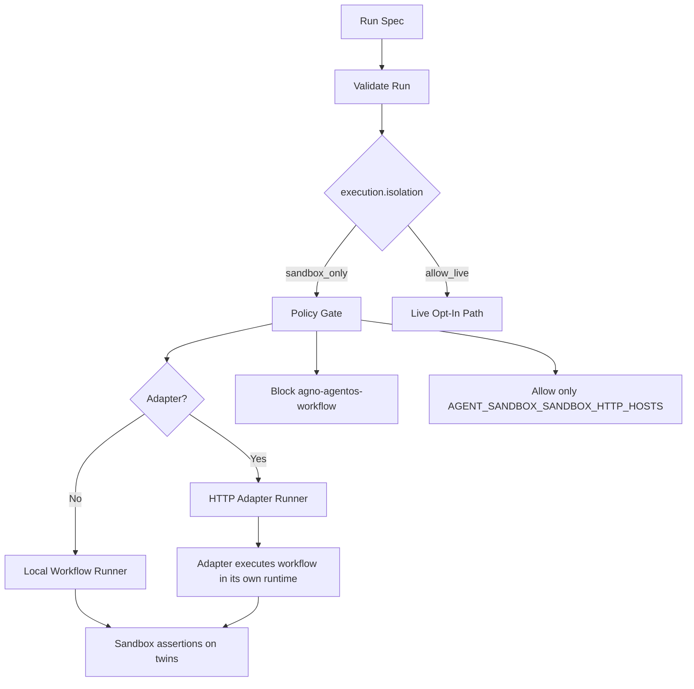
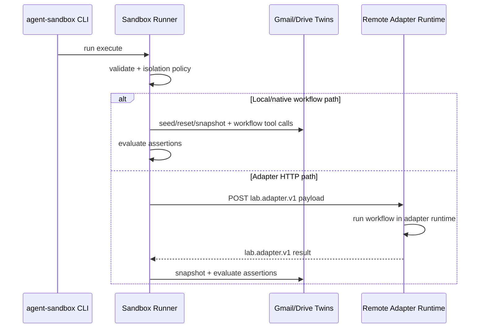

# Agent Sandbox Safety Model

This is the minimum practical model for safe execution without overengineering.

## Baseline rules

1. Default all runs to `execution.isolation: sandbox_only`.
2. Use local/native workflow execution for most CI and development checks.
3. Treat remote adapter execution as safe only when adapter runtime is explicitly lab-isolated.
4. Keep live runs opt-in (`execution.isolation: allow_live`) and out of p0 smoke.

## What is safe by default

- `sandbox_only` blocks:
  - `agno-agentos-workflow` protocol
  - non-allowlisted HTTP hosts for adapters
- Enforcement happens in both:
  - `run validate`
  - runtime execution

Config:
- `AGENT_SANDBOX_SANDBOX_HTTP_HOSTS` controls allowed HTTP hosts in `sandbox_only`.

## Minimum controls for remote adapters

When using remote adapter mode, require all three:

1. Lab-only deployment of remote runtime (not shared with production).
2. Lab-only credentials/tokens (no production secrets mounted).
3. Network egress policy blocking direct Google APIs except twin endpoints.

Without these, remote adapters can talk to production.

## Execution flow

## Local vs remote behavior

## Tier policy

- `p0-smoke`: deterministic, sandbox-only runs only.
- `p1-deep`: broader deterministic + variant runs.
- live adapter checks: separate from p0 (opt-in), run intentionally.

